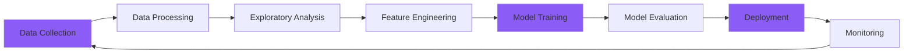

<div align="center">

<!-- Banner -->


<!-- If you prefer the static version or the GIF doesn't load, use: -->
<!--  -->

<br/><br/>

<!-- Social Badges -->
[](https://linkedin.com/in/adithyanagamuneendran)
[](mailto:adithya1755@gmail.com)
[](https://github.com/adhi1755)


</div>

---

## 🚀 About Me

```yaml
name: Adithya Nagamuneendran
role: Data Science Student & Full-Stack Developer
education: B.Tech in Computer Science Engineering (Data Science)
location: Vellore, Tamil Nadu, India
current_focus: 
  - Machine Learning & Deep Learning
  - Building scalable web applications
  - Data-driven solutions
interests:
  - Artificial Intelligence
  - Full-Stack Development
  - Data Analytics & Visualization
  - Cloud Computing
motto: "Building today what my future self will be proud of."
```

- 🔭 Currently working on **AI-powered web applications**
- 🌱 Learning **Advanced ML algorithms & Cloud Architecture**
- 💡 Passionate about **merging AI with real-world applications**
- 📊 Love turning **data into actionable insights**
- 🎯 Goal: **Contribute to impactful open-source ML projects**
- 💬 Ask me about **Python, React, Machine Learning, or Data Science**
- ⚡ Fun fact: **I debug with console.log and print() 😄**

---

## 💻 Tech Stack

### 👨‍💻 Programming Languages
<p>


</p>

### 🌐 Web Development
<p>


</p>

### 🗄️ Databases & Cloud
<p>


</p>

### 📊 Data Science & Machine Learning
<p>


</p>

### 🛠️ Tools & Technologies
<p>


</p>

---

## 📊 GitHub Statistics

<div align="center">
  


</div>

---

## 🏆 GitHub Achievements

<div align="center">
  


</div>

---

## 📈 Contribution Graph

<div align="center">
  
[](https://github.com/adhi1755)

</div>

---

## 💼 What I'm Currently Working On

```javascript
const adithya = {
    currentlyLearning: [
        "Deep Learning & Neural Networks",
        "Cloud Architecture (AWS & Azure)",
        "Advanced Data Structures & Algorithms"
    ],
    workingOn: [
        "AI-powered full-stack applications",
        "Machine Learning model deployment",
        "Data analytics dashboards"
    ],
    goals2025: [
        "Master advanced ML techniques",
        "Build production-ready AI applications",
        "Contribute to open-source ML projects",
        "Expand cloud computing expertise"
    ],
    funFact: "I debug with console.log and print() 😄"
};
```

---

## 🎓 Learning Journey

<div align="center">



</div>

**Current Focus Areas:**
- 🤖 Building end-to-end ML pipelines
- 🌐 Developing scalable web applications
- 📊 Creating interactive data visualizations
- ☁️ Deploying models to cloud platforms

---

## 🤝 Let's Connect & Collaborate!

<div align="center">

I'm always open to interesting conversations, collaboration opportunities, and learning from fellow developers!

[](https://linkedin.com/in/adithyanagamuneendran)
[](mailto:adithya1755@gmail.com)
[](#)

**Open to:**
- 💼 Internship opportunities in ML/AI or Full-Stack Development
- 🤝 Collaborative projects in Data Science
- 📚 Knowledge sharing and tech discussions
- 🚀 Open-source contributions

</div>

---

<div align="center">
  
### 💭 Random Dev Quote
  


---

### 📫 How to Reach Me

**Email:** adithya1755@gmail.com  
**LinkedIn:** [adithyanagamuneendran](https://linkedin.com/in/adithyanagamuneendran)  
**GitHub:** [@adhi1755](https://github.com/adhi1755)

---


**⭐ "Building today what my future self will be proud of."**

*If you find my projects interesting, feel free to ⭐ star them!*

</div>
